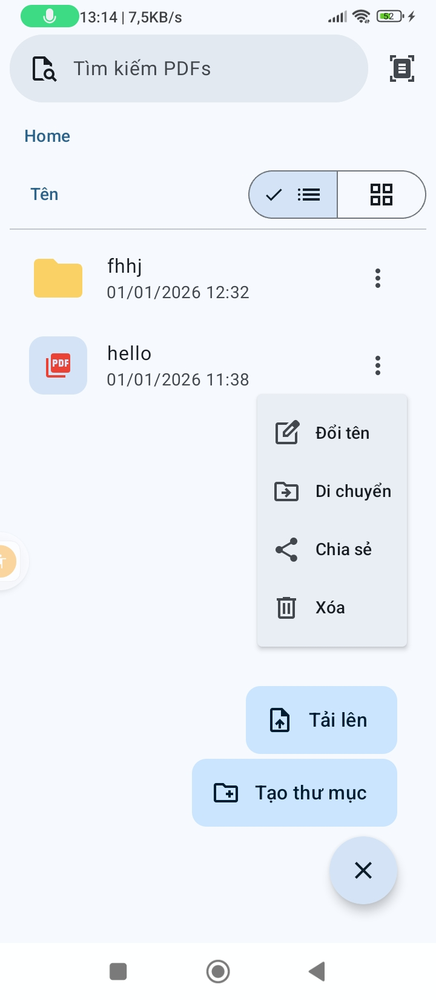
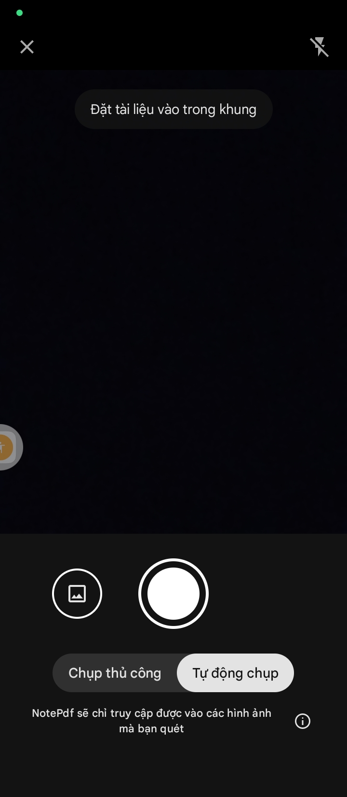
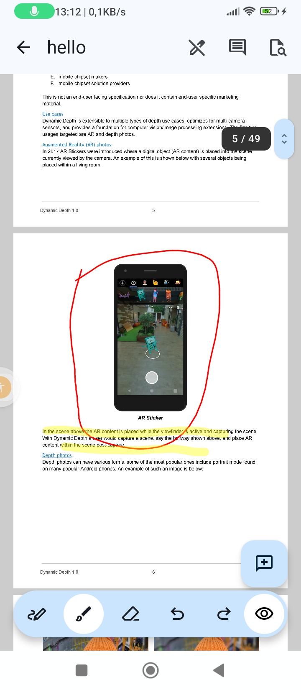
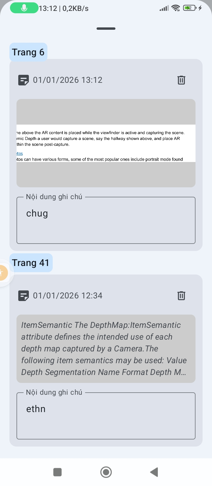

# NotePdf

NotePdf là một ứng dụng Android hiện đại được thiết kế để quản lý và ghi chú trực tiếp trên các tệp PDF. Ứng dụng cung cấp hệ thống quản lý tệp tin phân cấp mạnh mẽ cùng với khả năng vẽ, viết tay mượt mà.

## 📸 Hình ảnh

<p align="center">
  
  
  
  
</p>

## 🚀 Tính năng chính

- **Quản lý hệ thống tệp tin:**
  - Tổ chức dữ liệu theo cấu trúc thư mục (Folder) lồng nhau.
  - Hỗ trợ di chuyển (Move), đổi tên (Rename) và xóa (Delete) cả thư mục và tài liệu.
  - Theo dõi lịch sử ngăn xếp thư mục (Folder Stack) để điều hướng dễ dàng.
- **Xử lý PDF:**
  - Nhập tệp PDF từ bộ nhớ ngoài và lưu trữ an toàn trong bộ nhớ nội bộ của ứng dụng.
  - Tự động tạo ảnh thu nhỏ (Thumbnail) cho các trang PDF.
  - Xem PDF.
- **Ghi chú & Vẽ tay (Ink):**
  - Hỗ trợ viết tay và vẽ lên các trang PDF.
  - Lưu trữ các nét vẽ (Ink Strokes) dưới dạng dữ liệu vector trong cơ sở dữ liệu Room.
- **Tìm kiếm:**
  - Tìm kiếm nhanh chóng các thư mục và tài liệu theo tên ngay khi đang nhập.
- **Công nghệ nhận dạng (ML Kit):**
  - Tích hợp nhận dạng chữ viết tay (Digital Ink Recognition) và nhận dạng văn bản (Text Recognition).

## 🛠 Tech Stack

- **Ngôn ngữ:** [Kotlin](https://kotlinlang.org/)
- **UI Framework:** [Jetpack Compose](https://developer.android.com/jetpack/compose)
- **Dependency Injection:** [Hilt](https://developer.android.com/training/dependency-injection/hilt-android)
- **Database:** [Room](https://developer.android.com/training/data-storage/room) (Hỗ trợ Transaction, Foreign Keys, và Recursive Queries)
- **Navigation:** Navigation 3
- **Image Loading:** [Coil](https://coil-kt.github.io/coil/)
- **Machine Learning:** Google ML Kit

## 📂 Cấu trúc dự án

```text
ie.app.notepdf
├── data
│   ├── local
│   │   ├── dao        # Định nghĩa các truy vấn cơ sở dữ liệu (Room DAOs)
│   │   ├── entity     # Các bảng (Tables): Folder, Document, InkStroke
│   │   ├── relation   # Các POJO cho quan hệ dữ liệu (One-to-Many)
│   │   ├── repository # Lớp trừu tượng hóa dữ liệu
│   │   └── NotePdfDatabase.kt
├── di                 # Hilt Modules & Managers
├── ui
│   ├── screens
│   │   ├── home       # Màn hình quản lý tệp tin
│   │   └── pdf        # Màn hình xem và ghi chú PDF
│   └── theme          # Cấu hình giao diện Material3
└── MainActivity.kt    # Entry point của ứng dụng
```

## ⚙️ Cài đặt

1. Clone repository:
   ```bash
   git clone https://github.com/22026541-dxtruong/NotePdf.git
   ```
2. Mở dự án trong **Android Studio (Ladybug hoặc mới hơn)**.
3. Build và chạy trên thiết bị vật lý hoặc Emulator.

Dự án này được phát triển cho mục đích học tập và quản lý cá nhân.
